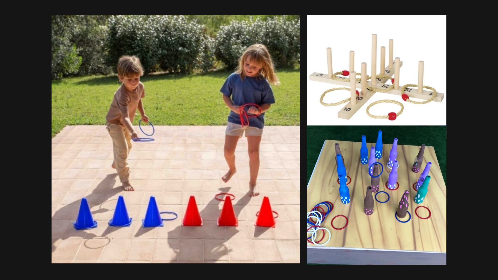
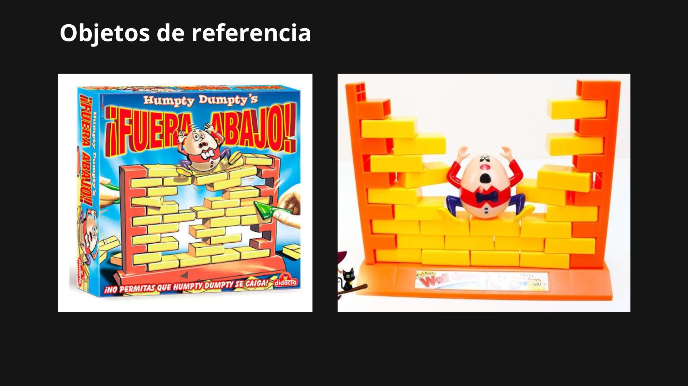
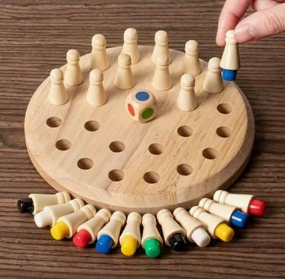

# Contexto de Design

Este projeto integra a coleção de brinquedos da marca Nestor, desenvolvida com o objetivo de criar brinquedos de madeira sustentáveis inspirados em contos, fábulas e narrativas infantis clássicas. A coleção é constituída por três brinquedos distintos — **Oopsie Dumty**, **Turtle & Hare** e **Pinocchio’s Lies** — que, apesar de apresentarem mecânicas de jogo diferentes, partilham os mesmos princípios de aprendizagem, criatividade e desenvolvimento infantil através do brincar.

## 1. Resumo / Abstract

### Resumo (PT)

Este projeto integra a coleção de brinquedos da marca Nestor, um conjunto de produtos educativos desenvolvidos a partir de uma abordagem sustentável e inspirados em contos e narrativas infantis clássicas. A coleção é composta por três brinquedos — **Oopsie Dumty**, **Turtle & Hare** e **Pinocchio’s Lies** — que exploram diferentes mecânicas de jogo, mas partilham o mesmo objetivo: promover o desenvolvimento infantil através da criatividade, da interação e da aprendizagem pelo brincar.

Todos os brinquedos foram concebidos com especial atenção à sustentabilidade, recorrendo maioritariamente à madeira como material principal e a sistemas de encaixe simples, que facilitam a produção, reduzem desperdício e permitem uma montagem intuitiva. Esta abordagem reforça também a durabilidade e a possibilidade de reutilização dos elementos do jogo.

Cada produto da coleção desenvolve competências específicas. O **Oopsie Dumty** centra-se no equilíbrio, na destreza e na concentração, desafiando os jogadores a removerem tijolos de um muro sem provocar a queda da estrutura nem do ovo no topo. O **Turtle & Hare** explora a memória, a perceção e o raciocínio estratégico através de um sistema de puzzle e organização espacial. Já o **Pinocchio’s Lies** foca-se na coordenação motora e na precisão, através de um jogo de lançamento e controlo de movimentos.

Em conjunto, a coleção Nestor procura criar experiências lúdicas coerentes e complementares, promovendo o desenvolvimento cognitivo, motor e social das crianças através de diferentes formas de interação com o brinquedo.

### Abstract (EN)
This project is part of the Nestor toy collection, a set of educational wooden toys developed through a sustainable approach and inspired by classic children’s tales and narratives. The collection includes three toys — **Oopsie Dumpty**, **Turtle & Hare**, and **Pinocchio’s Lies** — each featuring different gameplay mechanics while sharing the same goal: to support children’s development through creativity, interaction, and learning through play.

All toys are designed with sustainability in mind, primarily using wood as the main material and simple interlocking systems that facilitate production, reduce waste, and ensure intuitive assembly. This approach also enhances durability and encourages reuse of game components.

Each product in the collection develops specific skills. **Oopsie Dumpty** focuses on balance, dexterity, and concentration, challenging players to remove bricks from a wall without causing the structure or the egg on top to fall. **Turtle & Hare** explores memory, perception, and strategic thinking through a puzzle-based spatial organization system. **Pinocchio’s Lies** emphasizes motor coordination and precision through a throwing and aiming mechanic.

Together, the Nestor collection aims to create coherent and complementary play experiences that foster cognitive, motor, and social development in children through diverse forms of interaction with toys.

## 2. Referências Coletivas

### 2.1. Recolha de Objetos a Redesenhar/Remisturar

**2024294-Fabiana** - O Pinocchio's Lies inspira-se nos tradicionais jogos de lançamento de argolas, uma atividade recreativa popular há várias gerações e presente em feiras, festivais e espaços de lazer em todo o mundo. A simplicidade das suas regras e a combinação entre diversão e desafio tornaram este tipo de jogo um clássico intemporal.

A escolha deste jogo surgiu da sua ligação pessoal à personagem de Pinóquio. Desde criança, os jogos de argolas faziam-me lembrar o nariz comprido da personagem, criando uma associação imediata entre a mecânica do jogo e o universo da fábula. Esta memória serviu de inspiração para desenvolver um brinquedo que combina uma atividade tradicional com uma narrativa clássica da infância.

Desta forma, o projeto procura preservar o caráter lúdico dos jogos de argolas, integrando-o numa identidade visual inspirada em Pinóquio e alinhada com os valores de sustentabilidade e criatividade da marca Nestor.

**2024349-Antony** - O **Oopsie Dumty** inspira-se em jogos de mesa antigos destinados ao público infantil, especialmente aqueles baseados em equilíbrio, destreza e manipulação de peças, muito comuns em contextos recreativos antigos como feiras, brinquedos educativos e jogos de madeira clássicos. Estes jogos destacam-se pela sua simplicidade de regras e pela forma como combinam diversão imediata com um desafio progressivo de coordenação e concentração.

A escolha deste tipo de mecânica surge do interesse em reinterpretar experiências lúdicas intemporais, em que o contacto físico com as peças e a tensão do jogo são elementos centrais. No caso do _Oopsie Dumty!_, esta inspiração é reinterpretada através da dinâmica de retirar tijolos de um muro sem provocar a queda da estrutura nem do ovo colocado no topo, criando um jogo de equilíbrio acessível, mas desafiante.

**2024265-Márcia** - O jogo de tabuleiro em madeira Turtle & Hare nasce de um processo de redesenho e reinterpretação material, com o objetivo de transpor o rigor mecânico e a lógica dos jogos de memória digitais para a tangibilidade de um objeto físico. O seu desenvolvimento formal partiu de uma análise detalhada de jogos educativos, focando-se no estímulo da memória, da coordenação motora fina e da competitividade saudável em contexto infantil. Visualmente, o projeto foi desenhado em perfeita sintonia com a identidade da marca Nestor, utilizando formas geométricas nos peões que garantem uma coerência estética e material com a coleção coletiva do grupo. A escolha da clássica fábula "A Tartaruga e a Lebre" como tema central justifica-se pela sua capacidade de unir esta vertente técnica a uma narrativa universalmente conhecida. O contraste icónico entre a lentidão persistente da tartaruga e a rapidez impulsiva da lebre traduz-se de forma ideal na dinâmica mecânica do tabuleiro, onde o ritmo de avanço é ditado pela memória dos jogadores. Assim, o jogo consegue funder o design estruturado e os valores pedagógicos da paciência e do foco numa peça de madeira que é, ao mesmo tempo, um desafio lógico e uma extensão natural do universo visual do grupo.

### 2.2. Moodboard

Painel de referências visuais e conceptuais que orientam a estratégia do grupo.

