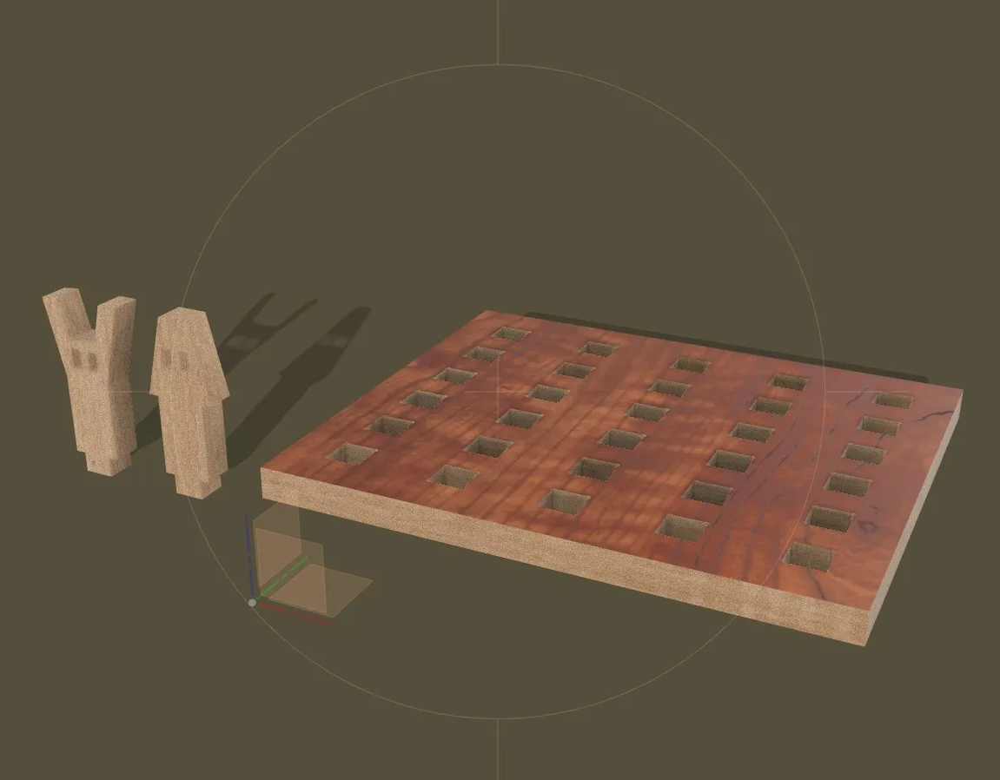
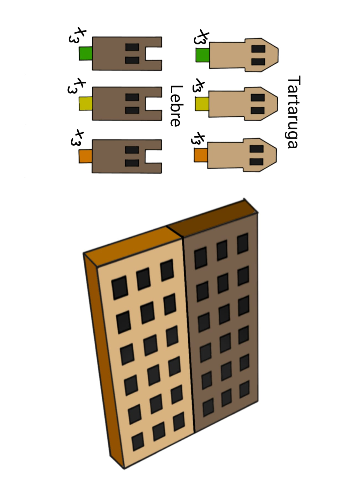

# Turtle&Hare - Jogo de memória

<!--
  HERO: idealmente uma pseudo-sessão fotográfica do produto
  (ver tutorial Pletor.ai nos Recursos da disciplina, em
  /Recursos/AI_exps/). Usa attachments/hero.jpg para o frontmatter.
-->

Um jogo de memória inspirado na fábula da tartaruga e da lebre. Este jogo tem o objetivo de desenvolver a memória e de criar um momento divertido entre amigos.

## Conceito

**O que é?**
Trata-se de um jogo de memória em madeira, fielmente inspirado no conto clássico "A Tartaruga e a Lebre", que traduz a célebre corrida num desafio lúdico e tátil. O conjunto é concebido através de um sistema de peças de encaixe precisos, composto por um tabuleiro de base retangular e uma coleção de peões, totalizando 18 encaixes quadrangulares para acomodar 18 peões representativos da tartaruga e 18 peões representativos da lebre. A proposta assenta numa lógica de ordenação e eliminação estratégica, onde os jogadores devem identificar e organizar os seus peões correspondentes — como as peças com os mesmos números ocultos na sua base — e removê-los em grupos de três. A forma final resulta da articulação entre a estrutura de encaixe fixa e a manipulação dinâmica das peças amovíveis, permitindo que cada partida seja uma nova experiência de construção de memória e de reorganização espacial.

**Para quem?**
O jogo de tabuleiro **Turtle & Hare** é um jogo de memória especialmente desenhado para dois jogadores, que combina o desafio cognitivo com uma forte componente de interação social e competitividade saudável. Destina-se essencialmente ao público infantil em contexto educativo e recreativo, podendo ser utilizado tanto em ambientes pedagógicos formais como em situações de brincadeira livre.

**Porquê?**
O meu projeto propõe uma abordagem baseada na memória e na descoberta, incentivando o desenvolvimento da coordenação motora fina, da perceção espacial, da competitividade saudável e da capacidade de resolução de problemas através da manipulação e encaixe dos peões.

A integração das personagens do conto clássico procura estimular a imaginação e reforçar a ligação da criança ao universo da literatura infantil, transformando o processo de jogo e eliminação de peças numa experiência narrativa e exploratória sobre a paciência e a persistência. Paralelamente, o jogo valoriza uma dimensão sustentável através da utilização da madeira como material principal , que promove o reaproveitamento de materiais e o desenvolvimento de produtos educativos assentes em princípios de design consciente e responsável.

## Enquadramento

O **Turtle & Hare** integra a coleção de brinquedos da marca Nestor, um projeto centrado na criação de brinquedos de madeira sustentáveis inspirados em contos e narrativas clássicas, produzidos a partir do reaproveitamento de materiais. Em conjunto com os projetos **Oopsie Dumpty** e **Pinocchio’s Lies**, partilha os valores de criatividade, aprendizagem e desenvolvimento infantil através do brincar.

Dentro desta coleção, distingue-se por combinar um sistema de puzzle de memória tridimensional com um tabuleiro de encaixe tátil, proporcionando simultaneamente uma experiência de raciocínio estratégico e de brincadeira livre. A utilização de elementos impressos em madeira, como os peões da lebre e da tartaruga, reforça a identidade visual da marca e a coerência entre os diferentes produtos da coleção — que exploram mecânicas distintas, desde o desafio de equilíbrio e tensão ao remover tijolos sem deixar cair o ovo no _Oopsie Dumpty_, até ao treino de precisão e coordenação motora ao acertar as argolas ordenadas no nariz do _Pinocchio’s Lies_.

## Tecnologia

O jogo foi desenvolvido usando um software de modelação 3D chamado Autodesk Fusion 360, onde modelei tanto o tabuleiro quanto as peças.

A produção do tabuleiro e dos peões foi feita utilizando tecnologia CNC, que cortou cada peça em um pedaço de MDF com 15 mm de espessura.

- Modelo 3D: https://a360.co/3PQ96T1
- Ficheiros: `attachments/`

## Função

O **Turtle & Hare** funciona simultaneamente como um jogo de memória e um tabuleiro de encaixe tátil; a criança organiza e combina as diferentes peças e peões com numeração oculta para esvaziar o tabuleiro, podendo posteriormente utilizá-los em brincadeiras livres e na recriação da clássica corrida graças às figuras tridimensionais das personagens.

O produto destina-se preferencialmente a crianças dos 5 aos 10anos, promovendo o desenvolvimento da coordenação motora, da capacidade de resolução de problemas e da memória visual.

A dinâmica de jogo é realizada através de encaixes simples entre as bases quadrangulares do tabuleiro e os peões da lebre e da tartaruga, permitindo uma experiência intuitiva e repetível.

## Apresentação

**Processo**
1º Pesquisa individual e modelação digital

2ºModelação no Fusion 360, preparação dos ficheiros, corte CNC, montagem e acabamentos finais.

3ºEsboços e Pranchas-Resumo

-Exploração de formas, encaixes e organização dos elementos através de esboços e pranchas de síntese.

-Desenhos em papel -Exploração de variantes.

4ºModelos 3D

**Pesquisa**
Análise de jogos de tabuleiro educativos em madeira, com referências focadas no desenvolvimento da memória, da coordenação motora fina e da competitividade saudável em contexto infantil. Foram valorizadas as formas presentes na identidade visual da marca Nestor, bem como a coerência estética entre os projetos coletivos do grupo. A linguagem visual associada à narrativa clássica e às formas geométricas dos peões influenciou diretamente o desenvolvimento formal do **Turtle & Hare**, garantindo uma ligação consistente entre o projeto individual — assente no rigor mecânico do jogo de tabuleiro — e o universo visual e material da coleção.

**Objetos de referencia**
Contos infantis, jogos de tabuleiro simples mas desafiadores e jogos digitais.

---

## Processo

O percurso completo de iterações, modelos e pesquisa está em [processo.md](processo.md), organizado do **mais recente** para o **mais antigo**.

[Ver processo completo →](processo.md)