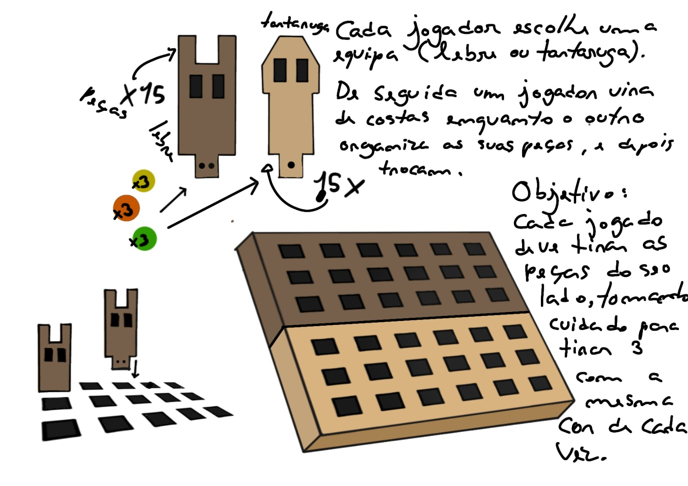
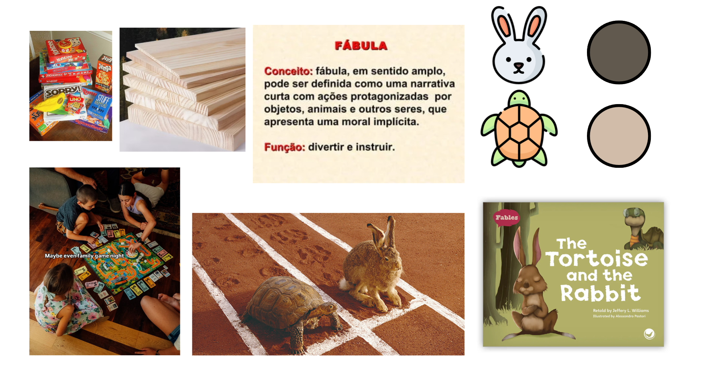

# Processo

## 1.Modelos 3D

Embed do Fusion (visualização do modelo paramétrico).

https://a360.co/3PQ96T1

## 2. Esboços e Pranchas-Resumo

Desenhos manuais, 
pranchas A3 de síntese, 
exploração de variantes.

## 3. Pesquisa

### 3.1. Aspectos valorizados do moodboard.

