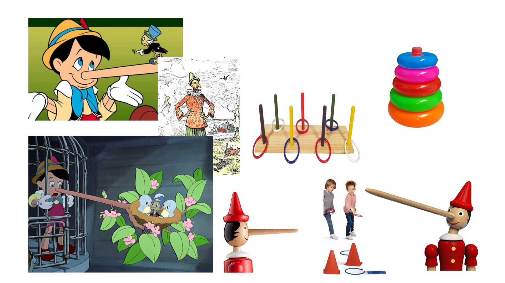
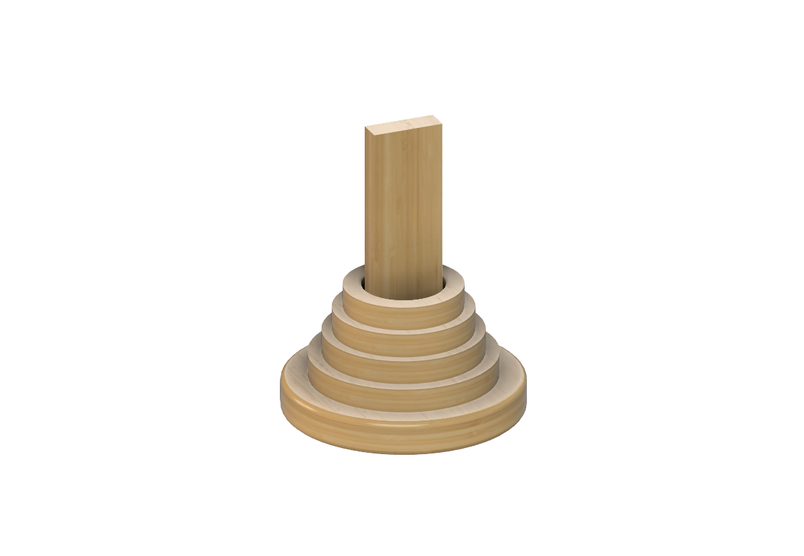

# Pinocchio’s Lies - Jogo de precisão.

<!--
  HERO: idealmente uma pseudo-sessão fotográfica do produto
  (ver tutorial Pletor.ai nos Recursos da disciplina, em
  /Recursos/AI_exps/). Usa attachments/hero.jpg para o frontmatter.
-->
## Conceito

#### Ideia central
**Pinocchio’s Lies** é um jogo de pontaria e destreza inspirado na clássica história do Pinóquio. O objetivo é lançar argolas e tentar encaixá-las numa haste vertical, desafiando a precisão e o controlo dos movimentos dos jogadores.

O jogo foi concebido para proporcionar momentos de diversão, competição saudável e interação social. As quatro argolas incluídas possuem diferentes dimensões, criando níveis de dificuldade progressivos: a argola maior é mais fácil de acertar, enquanto a menor representa o maior desafio. Desta forma, o jogo incentiva os participantes a melhorar gradualmente a sua pontaria e coordenação motora.
#### O que é?
**Pinocchio’s Lies** é um jogo de lançamento de argolas em madeira destinado a um ou mais jogadores. O conjunto é composto por uma base circular com uma haste vertical e quatro argolas de diferentes tamanhos. O objetivo consiste em lançar as argolas a partir de uma determinada distância e tentar encaixá-las na haste. À medida que os jogadores avançam para argolas mais pequenas, o desafio aumenta, exigindo maior precisão e controlo. As regras simples tornam o brinquedo acessível a todas as idades, permitindo partidas rápidas e dinâmicas em ambiente familiar, escolar ou recreativo.
#### Para quem?
A temática inspirada em Pinóquio e o seu design apelativo tornam o brinquedo especialmente atrativo para crianças, mas a mecânica de jogo é suficientemente desafiante para envolver jogadores de qualquer idade.

É ideal para famílias, escolas e espaços recreativos, promovendo a socialização e a competição saudável. Simultaneamente, contribui para o desenvolvimento da coordenação motora, da concentração, da percepção espacial e da precisão dos movimentos.

#### Porquê?
O **Pinocchio’s Lies** foi desenvolvido para criar uma experiência divertida e desafiante que estimule capacidades motoras e cognitivas através do brincar.

A necessidade de controlar a força, a direção e a trajetória do lançamento incentiva o desenvolvimento da coordenação óculo-manual, da concentração e da capacidade de avaliação espacial. A progressão da dificuldade, proporcionada pelas diferentes dimensões das argolas, mantém o interesse dos jogadores e incentiva a melhoria contínua do desempenho.

Além da componente lúdica, o brinquedo promove valores de sustentabilidade ao ser produzido a partir do reaproveitamento de madeira proveniente de resíduos da indústria do mobiliário, transformando materiais descartados num produto educativo e duradouro.

## Enquadramento

**Pinocchio’s Lies** integra a coleção de brinquedos da marca **Nestor**, um projeto dedicado à criação de brinquedos sustentáveis em madeira inspirados em contos e personagens clássicas da infância. Em conjunto com os projetos **Oopsie Dumpty** e **Turtle & Hare**, partilha os princípios de reutilização de materiais, aprendizagem através do brincar e valorização das narrativas tradicionais.

Dentro desta coleção, distingue-se por ser um jogo focado na pontaria e na precisão, proporcionando uma experiência simples, intuitiva e adequada para diferentes faixas etárias

## Tecnologia

O brinquedo foi desenvolvido recorrendo ao software de modelação 3D **Autodesk Fusion 360**, onde foram projetados e dimensionados todos os componentes do jogo, desde a base e haste até às diferentes argolas.

Numa fase inicial, o projeto foi concebido para ser produzido através de tecnologia **CNC**, utilizando madeira reaproveitada proveniente de resíduos da indústria do mobiliário. Esta abordagem permitiria uma produção mais eficiente, precisa e adequada à fabricação em série, mantendo simultaneamente os princípios de sustentabilidade da marca Nestor.

O projeto procurou sempre minimizar o desperdício de material e valorizar a reutilização da madeira, transformando resíduos em componentes funcionais, duráveis e adequados ao contexto lúdico e educativo do brinquedo.

https://a360.co/4glh2X1
## Função
O **Pinocchio’s Lies** funciona como um jogo de lançamento de argolas em que os jogadores tentam acertar numa haste vertical utilizando argolas de diferentes dimensões.

A dificuldade aumenta progressivamente à medida que se utilizam argolas mais pequenas, exigindo maior precisão e controlo do lançamento. O jogo pode ser jogado individualmente, como desafio pessoal, ou entre vários participantes através de sistemas de pontuação baseados nos diferentes níveis de dificuldade.

A sua mecânica simples e intuitiva proporciona uma experiência divertida e repetível, promovendo o desenvolvimento da coordenação motora, da concentração, da perceção espacial e da competitividade saudável.

## Apresentação

Imagens-chave que sintetizam o produto final.

---

## Processo

O percurso completo de iterações, modelos e pesquisa está em [processo.md](processo.md), organizado do **mais recente** para o **mais antigo**.

[Ver processo completo →](processo.md)
