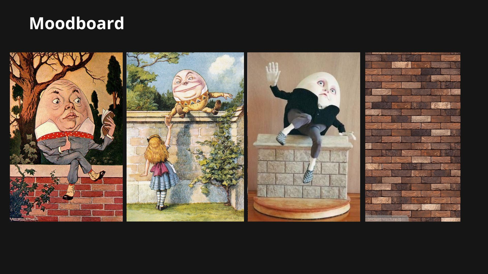
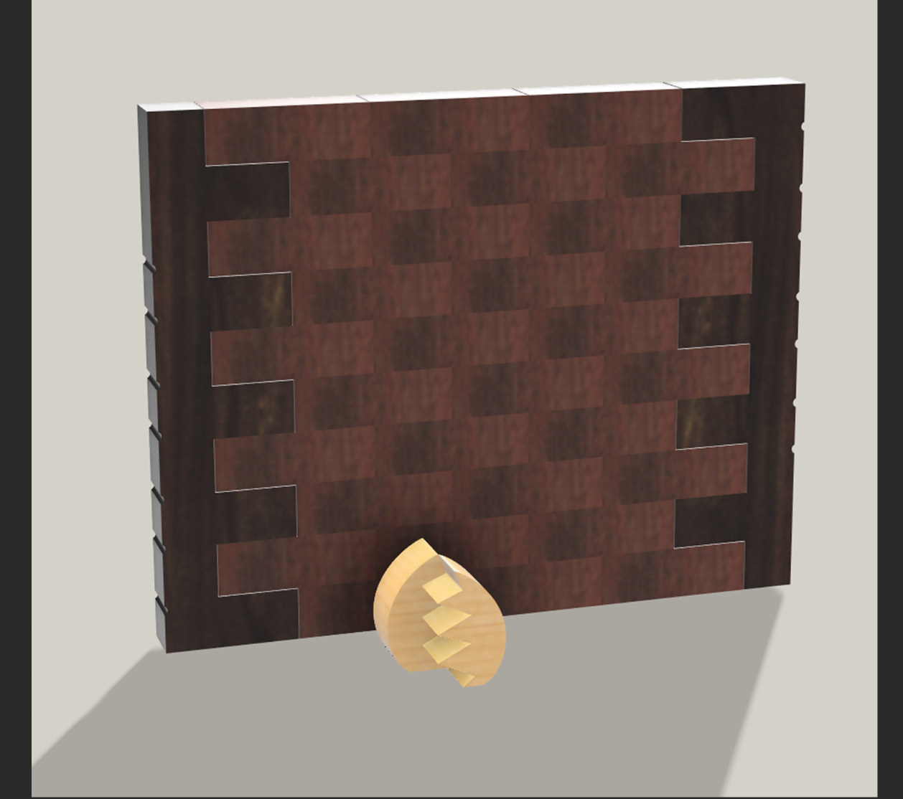

# Oopssie Dumty! - Jogo de precisão.

<!--
  HERO: idealmente uma pseudo-sessão fotográfica do produto
  (ver tutorial Pletor.ai nos Recursos da disciplina, em
  /Recursos/AI_exps/). Usa attachments/hero.jpg para o frontmatter.
-->
Um jogo para te divertires com o teu grupo de amigos e família, inspirado diretamente na personagem infantil _Humpty Dumpty_. O objetivo é retirar, à vez, os tijolos do muro sem deixar cair o ovo. Quem fizer o muro cair perde a partida.

## Conceito

#### O que é?
Este é um jogo de madeira concebido para ser jogado por duas ou mais pessoas, no qual os participantes retiram, à vez, um tijolo do muro. O objetivo é manter a estrutura equilibrada durante o maior tempo possível, sendo derrotado o jogador que provocar a queda do muro. O jogo inspira-se diretamente na cantiga infantil "Humpty Dumpty", representando a personagem em forma de ovo sobre um muro. É constituído por 34 peças de madeira: duas peças que formam o ovo, dois muros e 32 tijolos. Todas as peças foram desenhadas e fabricadas à medida para encaixarem corretamente entre si e garantirem a estabilidade da estrutura inicial.

#### Para quem?
A estética procura chamar a atenção dos mais pequenos da casa mas é um jogo que é perfeitamente jogável e divertido para pessoas mais adulta, permitindo a família toda participar nele. Para além de possuir um caráter lúdico, o jogo incentiva a concentração, a coordenação motora e a capacidade de planeamento, proporcionando uma experiência simples, divertida e desafiante para jogadores de diferentes idades.

#### Porquê?
O brinquedo tem como objetivo criar um ambiente divertido e competitivo para as crianças, no qual são necessárias atenção e concentração ao longo do jogo. Esta dinâmica permite desenvolver competências sociais associadas à competição saudável, bem como a compreensão de conceitos como o equilíbrio e a percepção espacial. O contexto inspirado numa personagem de um conto infantil incentiva também a imaginação das crianças e reforça a sua ligação ao universo das histórias tradicionais.

O jogo procura ser sustentável através da utilização de materiais reutilizáveis, como a madeira, e de um design baseado exclusivamente em encaixes e _dogbones_, eliminando a necessidade de elementos adicionais de fixação. Esta abordagem contribui ainda para uma produção em massa mais eficiente e económica.

## Enquadramento
O **Oopsie Dumpty** integra a coleção de brinquedos da marca Nestor, um projeto focado na criação de brinquedos de madeira sustentáveis inspirados em contos e narrativas clássicas, produzidos a partir do reaproveitamento de materiais. Em conjunto com os projetos **Turtle & Hare** e **Pinocchio’s Lies**, partilha valores de criatividade, aprendizagem e desenvolvimento infantil através do brincar. Este brinquedo distingue-se por propor um jogo de equilíbrio e destreza inspirado na cantiga infantil _Humpty Dumpty_. Os jogadores removem, à vez, os tijolos do muro sem provocar a queda da estrutura nem do ovo colocado no topo, num desafio que exige concentração, precisão e percepção espacial.

Tal como os restantes projetos da coleção, utiliza peças de madeira encaixáveis e um design sustentável, reforçando a coerência visual e conceptual da marca Nestor.
## Tecnologia
O jogo foi desenvolvido usando um software de modelação 3D chamado **Autodesk Fusion 360**, onde modelei tanto o tabuleiro quanto as peças.

A produção do tabuleiro e dos peões foi feita utilizando tecnologia **CNC**, que cortou cada peça em um pedaço de **MDF com 16 mm de espessura**.

- Modelo 3D: https://a360.co/3RBHtO3
- Ficheiros: `attachments/`

## Função
O **Oopsie Dumpty** funciona como um jogo de equilíbrio e destreza em que os jogadores, à vez, retiram cuidadosamente os tijolos do muro sem provocar o colapso da estrutura nem a queda do ovo no topo. À medida que o jogo avança, a instabilidade aumenta, tornando cada jogada mais desafiante e exigindo maior concentração e precisão.

A dinâmica do jogo baseia-se em peças de madeira encaixáveis, com uma estrutura simples e intuitiva que permite uma montagem rápida e uma experiência de jogo repetível, sempre diferente devido ao comportamento imprevisível da estabilidade do muro.

## Apresentação

---

## Processo

O percurso completo de iterações, modelos e pesquisa está em [processo.md](processo.md), organizado do **mais recente** para o **mais antigo**.

[Ver processo completo →](processo.md)
